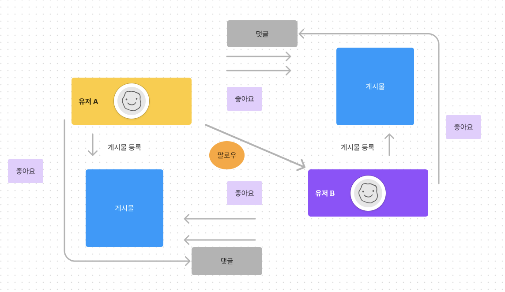
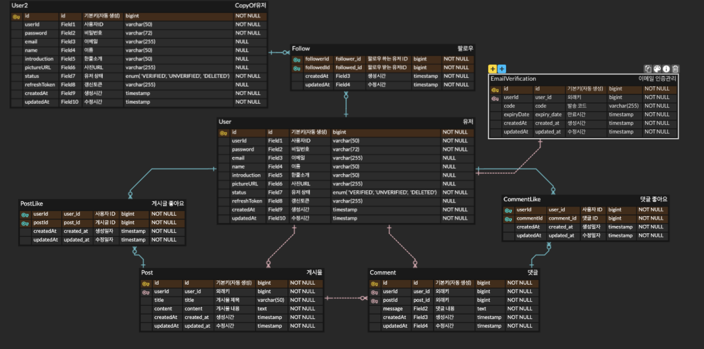

# 뉴스 피드 백엔드서버 팀 프로젝트

## 조 정보

- 조 : B-5조
- 팀명 : 조장조장조
- 팀구성 : 
  - 팀장 (이은규) 
  - 팀원 (양소영, 강현지, 김정민, 어동선) 


## 프로젝트 정보

### 사용 기술
- Java
- Spring boot
- JPA 
- MySQL 
- Junit 

### 인증 인가

#### 로그인 인증
- BCryptPasswordEncoder: 비밀번호 암호화 및 검증에 사용됩니다.
- Spring Security: 애플리케이션의 인증 및 권한 부여를 처리합니다.
- OAuth 2.0: 소셜 로그인(예: Google, Naver, Kakao)을 처리합니다.
- JWT (JSON Web Token): 인증 토큰으로 사용되며 로그인 성공 시, header에 토큰을 추가하고 성공 상태코드와 메세지를 반환합니다
  - JWT는 Access Token, Refresh Token을 구현합니다.
  - Access Token 만료시간 30분, Refresh Token 만료 시간 2주
  - Access Token 만료 시 :  유효한 Refresh Token을 통해 새로운 Access Token과 Refresh Token을 발급
  - Refresh Token 만료 시 : 재로그인을 통해 새로운 Access Token과 Refresh Token을 발급
  - API를 요청할 때는 Access Token을 사용합니다

1. 최초 로그인 처리
   - 일반 로그인:
   Spring Security가 사용자의 이메일과 비밀번호를 사용하여 인증합니다.
   사용자의 입력 비밀번호는 BCryptPasswordEncoder를 통해 암호화된 비밀번호와 비교됩니다.
   - 소셜 로그인:
   Spring Security와 OAuth 2.0을 사용하여 소셜 로그인 제공자(예: Google, Naver, Kakao)를 통해 인증을 처리합니다.
   인증 과정에서 소셜 제공자로부터 사용자 정보를 받아옵니다.
   - 인증 성공 후 처리:
   인증이 성공하면 서버는 JWT를 생성합니다.
   생성된 JWT는 쿠키에 저장되어 클라이언트에 반환됩니다.

2. 이후 요청 처리
   - JWT 포함 요청:
   클라이언트는 이후 모든 요청에 JWT를 로그인 성공 시, header에 토큰을 추가하고 성공 상태코드와 메세지를 반환합니다포함하여 서버에 전송합니다.
   - JWT 검증:
   Spring Security의 필터 체인에 추가된 JWT 필터가 모든 요청을 가로채고 JWT를 검증합니다.
   JWT 필터는 JWT의 서명과 만료 시간을 확인하여 유효성을 검증합니다.
   - 인증된 요청 처리
   JWT가 유효하면 해당 요청은 인증된 상태로 처리됩니다.
   인증된 사용자 정보는 SecurityContextHolder에 저장되어 이후의 요청 처리에 사용됩니다.

####  CRUD 인가
- 게시물, 댓글 : JWT을 통해 조회를 제외한 생성, 수정 ,삭제 기능들은 전부 작성자에게만 권한을 부여 한다.


## 설계

### Wireframe


### 파일 관리

- 도메인별 패키지화 관리
- domain
  - user(유저, 소셜계정, 팔로우)
  - profile(프로필)
  - post(게시물)
  - comment(게시물 댓글)
  - like(게시물 좋아요 , 댓글 좋아요)
- 각도메인에 대한 entity / service / controller / repository / dto 구분하여 역할에 맞게 관리
- 인증/ 인가 관련파일 패키지 분리 관리(auth)

### ERD 


```
User (1) ----------------- (1) Profile
User (1) ----------------- (N) SocialAccount
User (1) ----------------- (N) Follow  ----------------- User(1)
User (1) ----------------- (N) Post
User (1) ----------------- (N) Comment
User (1) ----------------- (N) PostLike
User (1) ----------------- (N) CommentLike
Post (1) ----------------- (N) Comment
Post (1) ----------------- (N) PostLike
Comment(1) ----------------- (N) CommentLike

```

### 공통 사용 코드
| HTTP 상태 코드 | 오류 코드 | 메시지                   | 설명                  |
|------------| ----- | --------------------- | ------------------- |
| 200        | S001  | Success               | 요청이 성공했습니다.         |
| 201        | S002  | Created               | 리소스가 성공적으로 생성되었습니다. |
| 400        | C001  | Invalid input value   | 유효하지 않은 입력 값입니다.    |
| 405        | C002  | Method not allowed    | 허용되지 않는 메서드입니다.     |
| 404        | C003  | Entity not found      | 엔티티를 찾을 수 없습니다.     |
| 500        | C004  | Internal server error | 내부 서버 오류입니다.        |
| 400        | C005  | Invalid type value    | 유효하지 않은 타입 값입니다.    |
| 403        | C006  | Access denied         | 접근이 거부되었습니다.        |
| 401        | C007  | Unauthorized          | 인증이 필요합니다.          |
| 409        | C008  | Duplicate entity      | 중복된 엔티티입니다.         |

### API 명세서


## 역할 분담, 구현 

### 구현 방식
- `각 도메인` 별로 당담하여 구현
- `CRUD` 중심으로 구현
- DB정보 변경 서비스 로직 트랜잭션을 적용(`@Transactional`)
- 위에 명시된 상태코드 사용하여 요청에 따른 `ResponseDTO` 던져주기 
- 종속 데이터 도메인 작업은 각각 로컬 DB사용하므로 개인적으로 임시적으로 SQL 스크립트를 사용하여 임시데이터를 만들어 (유저, 게시물) 테이블을 생성하고 데이터를 삽입해보는 방식으로 데이터 연결 확인
- `Junit` 사용해 단위 테스트 코드 작성


### User Part 
#### 회원 가입 
- [ ] 일반 회원가입 구현(아이디, 비밀번호 입력)  (/users/siginup)
- [ ] 이메일 회원가입 구현(아이디,비밀번호,이메일 입력) (/users/email-signup) 
- [ ] 이메일 회원가입시 이메일 인증 기능을 통해 본인 이메일 확인
- [ ] 이메일 회원가입시 인증번호 입력을 180초 안에 하지 않으면 유효하지 않음.
- [ ] 비밀 번호는 Bcrypt로 단방향-인코딩합니다.

- 예외처리
  - [ ] 중복된 ID, 탈퇴한 ID로는 회원가입 할 수 없습니다.
  - [ ] 사용자 ID는 대소문자 포함 영문 + 숫자만을 허용합니다.
  - [ ] 사용자 ID는 최소 10글자 이상, 최대 20글자 이하여야 합니다.
  - [ ] 비밀번호는 대소문자 포함 영문 + 숫자 + 특수문자를 최소 1글자씩 포함합니다.
  - [ ] 비밀번호는 최소 10글자 이상이어야 합니다
  - [ ] 비밀번호는 대소문자 포함 영문 + 숫자 + 특수문자를 최소 1글자씩 포함합니다.
  - [ ] 비밀번호는 최소 10글자 이상이어야 합니다.
  
#### 로그인
- [ ] 아이디를 통한 로그인(아이디, 비밀번호입력)
- [ ] 소셜 로그인 
  - [ ] 소셜 최초 로그인시 계정 연결
  - [ ] 연결된 소셜 선택 하여 로그인

- 로그인 처리
  - [ ] 로그인 시 클라이언트에게 토큰을 발행합니다.
  - [ ] 로그인 성공 시, header에 토큰을 추가하고 성공 상태코드와 메세지를 반환합니다.
  - [ ] Refresh Token이 유효한 상태가 되어야 합니다.

- 예외처리
  - [ ] 유효하지 않은 사용자 정보로 로그인을 시도한 경우 예외처리
  - [ ] 사용자 ID와 비밀번호가 일치하지 않는 사용자 정보로 로그인을 시도한 경우 예외처리
  
#### 로그아웃
- [ ] 로그아웃 시, 발행한 토큰은 초기화 합니다.
- [ ] 로그아웃 후 초기화 된 Refresh Token은 재사용할 수 없고, 재로그인해야 합니다

#### 회원 탈퇴
- [ ] Refresh Token이 유효하지 않은 상태가 되어야합니다.

#### 회원정보 수정
- [ ] 비밀 번호 수정
    - [ ] 비밀번호 수정 시, 본인 확인을 위해 입력한 현재 비밀번호가 일치하지 않은 경우 예외처리
    - [ ] 비밀번호 형식이 올바르지 않은 경우예외처리
    - [ ] 현재 비밀번호와 동일한 비밀번호로 수정하는 경우 예외처리
  
#### 인증, 인가
- [ ] Spring Security와 JWT를 사용하여 설계 및 구현합니다.
- [ ] JWT는 Access Token, Refresh Token을 구현합니다
- [ ] Access Token 만료 시 :  유효한 Refresh Token을 통해 새로운 Access Token과 Refresh Token을 발급
- [ ] Refresh Token 만료 시 : 재로그인을 통해 새로운 Access Token과 Refresh Token을 발급
- [ ] API를 요청할 때는 Access Token을 사용합니다.

#### 팔로우
  - [ ] 특정 사용자를 팔로우 / 언팔로우를 할 수 있습니다.

### Profile Part

### Post Part

### Comment Part

### Like Part
